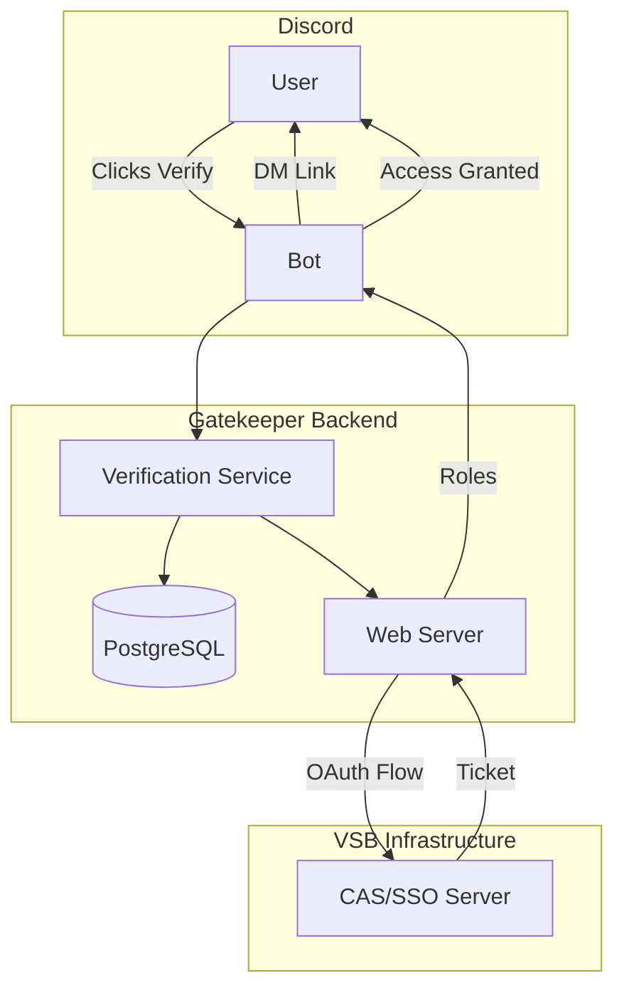

# 🔐 VSB Gatekeeper - Discord CAS Verification Bot

[](https://www.python.org/downloads/)
[](https://github.com/Rapptz/discord.py)
[](https://www.postgresql.org/)
[](https://www.docker.com/)
[](LICENSE)
[](https://github.com/KasheK420/py_vsb_gatekeeper/graphs/commit-activity)

> **Enterprise-grade Discord verification bot for VSB - Technical University of Ostrava**  
> Secure student and faculty authentication via CAS/SAML SSO integration

<div align="center">
  
  
  
</div>

---

## 📋 Table of Contents

- [Overview](#-overview)
- [Features](#-features)
- [Architecture](#-architecture)
- [Quick Start](#-quick-start)
- [Installation](#-installation)
- [Configuration](#-configuration)
- [Usage](#-usage)
- [API Documentation](#-api-documentation)
- [Security](#-security)
- [Development](#-development)
- [Testing](#-testing)
- [Deployment](#-deployment)
- [Troubleshooting](#-troubleshooting)
- [Contributing](#-contributing)
- [License](#-license)
- [Author](#-author)
- [Acknowledgments](#-acknowledgments)

---

## 🎯 Overview

**VSB Gatekeeper** is a production-ready Discord bot that provides secure authentication for university Discord servers. It seamlessly integrates with VSB-TUO's CAS (Central Authentication Service) to verify student and faculty identities, automatically assigning appropriate roles based on university affiliation.

### Why Gatekeeper?

- **🔒 Security**: Enterprise-grade OAuth 2.0 flow with state validation
- **⚡ Performance**: Async architecture handles thousands of concurrent verifications
- **🎓 Smart Role Assignment**: Automatically distinguishes students from faculty
- **📊 Complete Audit Trail**: Every verification attempt is logged for compliance
- **🔄 Re-verification Support**: Annual security checks with role preservation
- **🌍 Bilingual**: Full Czech and English language support

---

## ✨ Features

### Core Functionality
- ✅ **CAS/SAML SSO Integration** - Direct integration with VSB authentication system
- ✅ **Automatic Role Management** - Student/Teacher/Erasmus roles based on CAS attributes
- ✅ **Secure State Management** - Cryptographically secure OAuth flow with 15-minute expiry
- ✅ **Role Preservation** - Maintains user roles during re-verification
- ✅ **Comprehensive Logging** - Full audit trail for security compliance

### User Experience
- 🎯 **One-Click Verification** - Simple button interaction to start
- 📱 **DM Notifications** - Private verification links sent directly
- 🌐 **Beautiful Web Pages** - Professional success/error pages
- ⏱️ **Quick Process** - Complete verification in under 60 seconds
- 🔄 **Automatic Rejoin Handling** - Remembers verified users

### Administration
- 👮 **Admin Commands** - Manual verification triggers and status checks
- 📊 **User Metrics** - Track joins, bans, and verification statistics
- 🔍 **Verification Status** - Check any user's verification details
- 📝 **Event History** - Complete log of user join/leave/ban events
- 🔄 **Bulk Operations** - Re-verify entire roles (planned)

### Technical Excellence
- 🐳 **Docker Ready** - One-command deployment with docker-compose
- 🗄️ **PostgreSQL Backend** - Robust data persistence
- 🔌 **Modular Architecture** - Clean separation of concerns
- 🧪 **Comprehensive Tests** - Full test coverage for critical paths
- 📈 **Scalable Design** - Handles large server populations

---

## 🏗️ Architecture



### Technology Stack

| Component | Technology | Purpose |
|-----------|------------|---------|
| **Core Bot** | Python 3.11+ | Main application runtime |
| **Discord API** | discord.py 2.3+ | Discord integration |
| **Database** | PostgreSQL 15 | Data persistence |
| **ORM** | SQLAlchemy 2.0 | Database abstraction |
| **Web Server** | aiohttp | OAuth callback handling |
| **Authentication** | CAS Protocol v3 | University SSO integration |
| **Container** | Docker | Deployment and isolation |
| **Orchestration** | docker-compose | Service management |

---

## 🚀 Quick Start

### Prerequisites
- Docker & Docker Compose
- Discord Application with Bot Token
- VSB CAS/OAuth credentials
- Domain with SSL for callbacks

### 30-Second Deploy

```bash
# Clone repository
git clone https://github.com/KasheK420/py_vsb_gatekeeper.git
cd py_vsb_gatekeeper

# Configure environment
cp .env.example .env
# Edit .env with your credentials

# Deploy
docker-compose up -d

# View logs
docker-compose logs -f bot
```

---

## 📦 Installation

### Method 1: Docker (Recommended)

```bash
# Clone the repository
git clone https://github.com/KasheK420/py_vsb_gatekeeper.git
cd py_vsb_gatekeeper

# Copy and configure environment
cp .env.example .env
nano .env  # Add your configuration

# Build and start services
docker-compose up -d --build

# Initialize database
docker-compose exec bot python -c "
import asyncio
from bot.db.database import init_database
from bot.util.config_loader import load_config
asyncio.run(init_database(load_config().database_url))
"

# Check status
docker-compose ps
```

### Method 2: Manual Installation

```bash
# System dependencies
sudo apt-get update
sudo apt-get install -y python3.11 python3.11-venv postgresql-client

# Clone repository
git clone https://github.com/KasheK420/py_vsb_gatekeeper.git
cd py_vsb_gatekeeper

# Create virtual environment
python3.11 -m venv venv
source venv/bin/activate

# Install dependencies
pip install --upgrade pip
pip install -r requirements.txt

# Setup PostgreSQL database
createdb gatekeeper
psql gatekeeper < schema.sql

# Configure environment
cp .env.example .env
nano .env

# Run the bot
python -m bot.main
```

---

## ⚙️ Configuration

### Essential Environment Variables

Create a `.env` file with the following configuration:

```env
# ===== Discord Configuration =====
DISCORD_TOKEN=your_bot_token_here
DISCORD_GUILD_ID=your_server_id

# ===== Database =====
DB_HOST=localhost
DB_PORT=5432
DB_NAME=gatekeeper
DB_USER=gatekeeper
DB_PASSWORD=secure_password_here

# ===== CAS/OAuth Configuration =====
CAS_SERVER_URL=https://www.sso.vsb.cz
CAS_LOGIN_URL=https://www.sso.vsb.cz/login
CAS_VALIDATE_URL=https://www.sso.vsb.cz/p3/serviceValidate
CAS_LOGOUT_URL=https://www.sso.vsb.cz/logout
SERVICE_URL=https://your-bot-domain.com/callback

# OAuth (Legacy compatibility)
OAUTH_CLIENT_ID=your_client_id
OAUTH_CLIENT_SECRET=your_client_secret
OAUTH_BASE_URL=https://your-bot-domain.com
OAUTH_AUTHORIZE_URL=https://www.vsb.cz/oauth2/authorize
OAUTH_TOKEN_URL=https://www.vsb.cz/oauth2/token
OAUTH_USERINFO_URL=https://www.vsb.cz/oauth2/userinfo
OAUTH_REDIRECT_URI=https://your-bot-domain.com/auth/callback

# ===== Verification Settings =====
VERIFICATION_CHANNEL_ID=channel_id_for_verification
VERIFICATION_STATE_EXPIRY_MINUTES=15

# ===== Role IDs =====
STUDENT_ROLE_ID=role_id_for_students
TEACHER_ROLE_ID=role_id_for_teachers
ERASMUS_ROLE_ID=role_id_for_erasmus_students
ADMIN_ROLE_ID=admin_role_id
MODERATOR_ROLE_ID=moderator_role_id

# ===== Security =====
STATE_SECRET_KEY=generate_32_char_secret_key_here
SESSION_SECRET_KEY=another_32_char_secret_key_here

# ===== Web Server =====
WEB_SERVER_HOST=0.0.0.0
WEB_SERVER_PORT=8080
WEB_SERVER_EXTERNAL_URL=https://your-bot-domain.com

# ===== Logging =====
LOG_LEVEL=INFO
LOG_CHANNEL_ID=optional_discord_channel_for_logs

# ===== Re-verification =====
ANNUAL_REVERIFICATION_ENABLED=true
REVERIFICATION_WINDOW_DAYS=14
REVERIFICATION_TARGET_ROLE=student_role_id
```

### Generating Secure Keys

```python
# Generate secure secret keys
import secrets
print(f"STATE_SECRET_KEY={secrets.token_urlsafe(32)}")
print(f"SESSION_SECRET_KEY={secrets.token_urlsafe(32)}")
```

---

## 💬 Usage

### For Users

1. **Join the Discord server** - You'll only see the verification channel
2. **Click the verification button** - "Ověřit se / Verify" 
3. **Complete VSB SSO login** - You'll be redirected to the official VSB login
4. **Return to Discord** - Your role is automatically assigned
5. **Access granted!** - Enjoy full server access

### For Administrators

#### Slash Commands

```
/reverify @user [reason]
```
Force a user to re-verify their account. Preserves their current roles.

```
/verify-status @user
```
Check detailed verification status including CAS login, email, and verification timestamps.

```
/setup-verification
```
Manually post the verification message in the configured channel.

#### Examples

```discord
/reverify @student "Annual security check"
# → Preserves roles, removes access, sends new verification link

/verify-status @teacher
# → Shows: CAS login, real name, email, verification date, role type

/setup-verification
# → Posts fresh verification embed with button in verification channel
```

---

## 📚 API Documentation

### Database Schema

#### Core Tables

| Table | Purpose | Key Fields |
|-------|---------|------------|
| `users` | Discord user records | `discord_id`, `login`, `activity`, `type` |
| `user_verification_data` | CAS verification data | `cas_login`, `cas_email`, `verified_at` |
| `verification_states` | Active OAuth flows | `state`, `discord_id`, `expires_at` |
| `verification_audit` | Audit trail | `discord_id`, `result`, `error_message` |
| `user_metrics` | Statistics | `join_count`, `bans`, `kicks` |
| `user_status_history` | Event log | `event_type`, `roles_at_event` |

### CAS Integration

The bot uses CAS Protocol v3 for authentication:

```python
# Authentication flow
1. Generate state token → Store in DB
2. Redirect to: {CAS_LOGIN_URL}?service={SERVICE_URL}?state={STATE}
3. CAS validates → Redirects back with ticket
4. Validate ticket: {CAS_VALIDATE_URL}?ticket={TICKET}&service={SERVICE_URL}
5. Parse XML response → Extract user attributes
6. Assign roles based on eduPersonAffiliation
```

---

## 🔒 Security

### Security Features

- **🔐 Cryptographic State Tokens**: 256-bit secure random tokens
- **⏱️ Time-Limited Sessions**: 15-minute expiry on all verification links
- **🔑 SHA256 State Validation**: HMAC-style state verification
- **🗑️ Immediate Cleanup**: States deleted immediately after use
- **📝 Complete Audit Trail**: Every attempt logged with IP and user agent
- **🚫 Rate Limiting**: Built-in protection against abuse
- **🔒 Role-Based Access**: Admin commands require specific roles
- **🛡️ SQL Injection Protection**: Parameterized queries via SQLAlchemy

### Security Best Practices

1. **Never share** your `.env` file or commit it to version control
2. **Rotate secrets** regularly (at least every 90 days)
3. **Use HTTPS** for all callback URLs
4. **Monitor** the audit logs for suspicious activity
5. **Limit** admin role assignments
6. **Enable** 2FA on your Discord bot account
7. **Backup** your database regularly

---

## 🛠️ Development

### Project Structure

```
py_vsb_gatekeeper/
├── bot/
│   ├── __init__.py
│   ├── main.py                 # Entry point
│   ├── cogs/                   # Discord command handlers
│   │   ├── verification.py     # Main verification logic
│   │   ├── verification_admin.py # Admin commands
│   │   └── user_events.py      # Event handlers
│   ├── services/               # Business logic
│   │   ├── cas_service.py      # CAS/SSO integration
│   │   └── verification_service.py # Verification logic
│   ├── web/                    # Web server
│   │   └── app.py              # OAuth callbacks
│   ├── db/                     # Database
│   │   ├── models.py           # SQLAlchemy models
│   │   └── database.py         # Connection management
│   └── util/                   # Utilities
│       └── config_loader.py    # Configuration
├── tests/                      # Test suite
│   └── test_gatekeeper.py      # Comprehensive tests
├── docker-compose.yml          # Container orchestration
├── Dockerfile                  # Container definition
├── requirements.txt            # Python dependencies
├── .env.example               # Configuration template
├── Makefile                   # Development commands
└── README.md                  # This file
```

### Development Setup

```bash
# Clone and setup
git clone https://github.com/KasheK420/py_vsb_gatekeeper.git
cd py_vsb_gatekeeper

# Create development environment
make dev-setup

# Activate virtual environment
source venv/bin/activate

# Install pre-commit hooks (optional)
pip install pre-commit
pre-commit install

# Run locally
python -m bot.main
```

### Useful Make Commands

```bash
make help        # Show all commands
make dev-setup   # Setup development environment
make test        # Run test suite
make logs        # View bot logs
make shell       # Access bot container
make db-shell    # Access database shell
make backup-db   # Backup database
```

---

## 🧪 Testing

### Running Tests

```bash
# Run comprehensive test suite
python tests/test_gatekeeper.py

# Run with coverage
pytest tests/ --cov=bot --cov-report=html

# Run specific test
pytest tests/test_gatekeeper.py::TestGatekeeperBot::test_user_join_flow
```

### Test Coverage

The test suite covers:
- ✅ User join/leave events
- ✅ Verification flow (button → CAS → role assignment)
- ✅ Teacher vs Student detection
- ✅ Re-verification with role preservation
- ✅ Expired token handling
- ✅ Ban/unban tracking
- ✅ Invalid CAS responses
- ✅ Duplicate verification prevention
- ✅ Database transactions
- ✅ Audit logging

---

## 🚢 Deployment

### Production Deployment with Docker

```bash
# 1. Clone repository on server
git clone https://github.com/KasheK420/py_vsb_gatekeeper.git
cd py_vsb_gatekeeper

# 2. Configure production environment
cp .env.example .env.prod
nano .env.prod  # Add production credentials

# 3. Deploy with docker-compose
docker-compose -f docker-compose.yml up -d

# 4. Setup SSL with nginx (example)
sudo apt-get install nginx certbot python3-certbot-nginx
sudo nano /etc/nginx/sites-available/gatekeeper

# 5. Enable HTTPS
sudo certbot --nginx -d your-bot-domain.com

# 6. Monitor deployment
docker-compose logs -f bot
```

### Nginx Configuration Example

```nginx
server {
    server_name your-bot-domain.com;
    
    location / {
        proxy_pass http://localhost:8080;
        proxy_http_version 1.1;
        proxy_set_header Upgrade $http_upgrade;
        proxy_set_header Connection 'upgrade';
        proxy_set_header Host $host;
        proxy_cache_bypass $http_upgrade;
        proxy_set_header X-Real-IP $remote_addr;
        proxy_set_header X-Forwarded-For $proxy_add_x_forwarded_for;
        proxy_set_header X-Forwarded-Proto $scheme;
    }
}
```

### Health Monitoring

```bash
# Check service health
curl https://your-bot-domain.com/health

# Monitor with systemd
sudo systemctl status docker-compose@py_vsb_gatekeeper

# Setup automatic restarts
docker-compose up -d --restart unless-stopped
```

---

## 🔧 Troubleshooting

### Common Issues and Solutions

#### Bot doesn't start
```bash
# Check logs
docker-compose logs bot

# Verify environment
docker-compose exec bot python -c "from bot.util.config_loader import load_config; print(load_config())"
```

#### Database connection errors
```bash
# Test connection
docker-compose exec db pg_isready

# Check credentials
docker-compose exec db psql -U gatekeeper -c "SELECT 1"
```

#### Users not receiving DMs
- Ensure users have "Allow direct messages from server members" enabled
- Check bot permissions for sending DMs
- Verify bot isn't rate-limited

#### Verification links expired
- Default expiry is 15 minutes
- Users must click button again for new link
- Can adjust `VERIFICATION_STATE_EXPIRY_MINUTES`

#### Roles not assigned
- Check bot role hierarchy (bot role must be higher)
- Verify role IDs in configuration
- Ensure bot has "Manage Roles" permission

### Debug Mode

```bash
# Enable debug logging
LOG_LEVEL=DEBUG docker-compose up

# View SQL queries
# In config_loader.py, set echo=True in database init
```

---

## 🤝 Contributing

We welcome contributions! Please see our [Contributing Guidelines](CONTRIBUTING.md).

### How to Contribute

1. Fork the repository
2. Create a feature branch (`git checkout -b feature/AmazingFeature`)
3. Commit your changes (`git commit -m 'Add some AmazingFeature'`)
4. Push to the branch (`git push origin feature/AmazingFeature`)
5. Open a Pull Request

### Development Guidelines

- Follow PEP 8 style guide
- Add tests for new features
- Update documentation
- Use type hints
- Write descriptive commit messages

---

## 📄 License

This project is licensed under the MIT License - see the [LICENSE](LICENSE) file for details.

```
MIT License

Copyright (c) 2024 Lukáš Majoros

Permission is hereby granted, free of charge, to any person obtaining a copy
of this software and associated documentation files (the "Software"), to deal
in the Software without restriction...
```

---

## 👤 Author

**Lukáš Majoros** ([@KasheK420](https://github.com/KasheK420))

- 🌐 GitHub: [KasheK420](https://github.com/KasheK420)
- 📧 Email: [Contact via GitHub](https://github.com/KasheK420)
- 🎓 University: VSB - Technical University of Ostrava

### Project Links

- 📦 Repository: [github.com/KasheK420/py_vsb_gatekeeper](https://github.com/KasheK420/py_vsb_gatekeeper)
- 🐛 Issues: [github.com/KasheK420/py_vsb_gatekeeper/issues](https://github.com/KasheK420/py_vsb_gatekeeper/issues)
- 📖 Wiki: [github.com/KasheK420/py_vsb_gatekeeper/wiki](https://github.com/KasheK420/py_vsb_gatekeeper/wiki)

---

## 🙏 Acknowledgments

- **VSB-TUO** - For providing CAS/SSO infrastructure
- **Discord.py Community** - For the excellent Discord API wrapper
- **SQLAlchemy Team** - For the powerful ORM
- **Open Source Community** - For continuous support and contributions

### Special Thanks

- Original VSB Discord bot developers for inspiration
- Beta testers from the VSB Discord community
- Contributors and bug reporters

---

<div align="center">

**Made with ❤️ for the VSB-TUO Discord Community**

[](https://github.com/KasheK420/py_vsb_gatekeeper/stargazers)
[](https://github.com/KasheK420/py_vsb_gatekeeper/network/members)
[](https://github.com/KasheK420/py_vsb_gatekeeper/watchers)

</div>